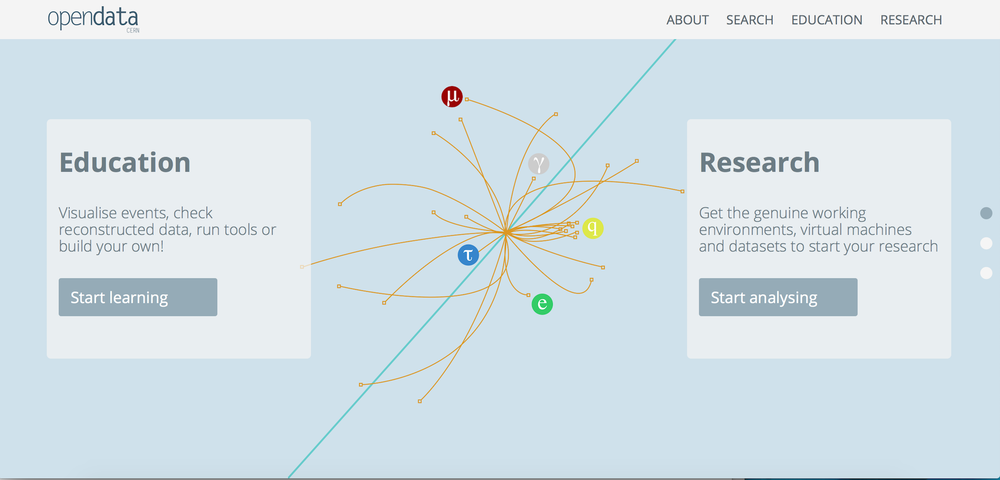

# ATLAS open data

Welcome to ATLAS at the LHC.  
We have prepared some data for you.  Come and take a look.  
It is ready for you to use, just for curiosity, as a teaching tool or to dive in and write your own analysis code.  

Use the arrows below to navigate through the documentation booklet.
Or click on the hamburger icon above to access the chapters directly.