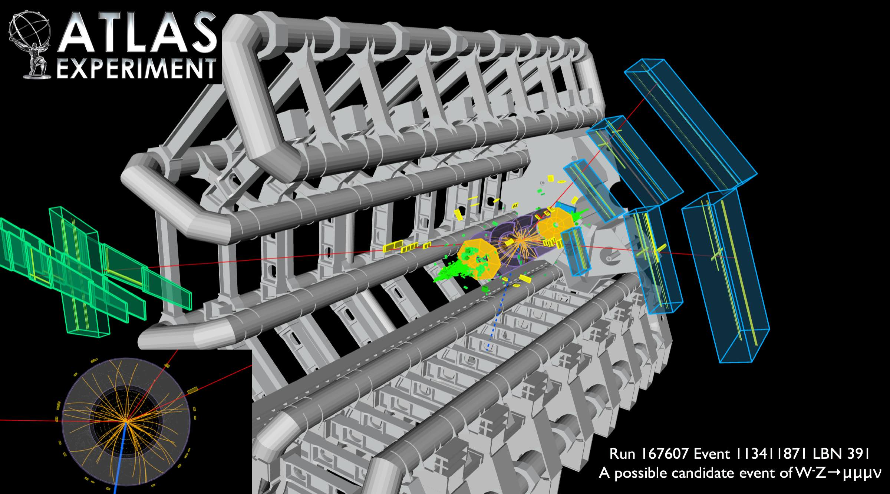

# Analyses

We have prepared seven analyses for you.  Ranging from measuring [Standard Model](http://home.cern/about/physics/standard-model) particles including a [Higgs](http://home.cern/topics/higgs-boson) analysis and a search for a Beyond the Standard Model particle.

## W Analysis

The [W](http://home.cern/about/physics/w-boson-sunshine-and-stardust) and [Z](http://home.cern/about/physics/z-boson) bosons are together known as the weak or the intermediate vector bosons. These Standard Model elementary particles mediate the weak interaction.  

The W boson analysis is intended to provide an example for a high statistics analysis using the ATLAS open data dataset. Furthermore it tests the description of the real data by the simulated W boson data which represents the most extensive dataset in terms of luminosity. 

The W analysis is potentially prone to QCD contributions as there is only one lepton present which may come from non-prompt sources mimicking the desired final state. Therefore, potential disagreements must always be understood as a sign that the QCD contributions are not taken into account.

An interesting variable to study would be the ratio W+/W− with respect to the pseudorapidity of the selected lepton.

## Z Analysis

Many analyses selecting leptons suffer from Z + jets as a contributing background due to its large production cross section. It is therefore vital to check the correct modelling of this process by the MOnte-Carlo simulated data.

It is important to measure well known Standard Model particles, to confirm that we understand properly the detector and software.  We are then ready to search for new physics.

Candidate event with a Z decay to muon pairs, recoiling against missing transverse energy (MET). The muon candidates have transverse momenta of 50 and 126 GeV.
The invariant mass of the two muons attributed to the Z candidate is 94 GeV; the MET is measured to be 161 GeV. 

## Top pair Analysis
The [top](https://en.wikipedia.org/wiki/Top_quark) pair analysis is interesting because it is a good test of the Standard Model.

It is important for discrimination between different data simulation generators,  [QCD](https://en.wikipedia.org/wiki/Quantum_chromodynamics) models and parton distribution functions.

In addition, top pair production is an important background in various Higgs boson analyses as well as beyond the Standard Model searches.  It is therefore crucial to understand this process in detail. 

ATLAS is a top factory and studying and understanding top physics is one of the major goals of its physics programme. This understanding is crucial for studying rarer processes as top pair production is a background to virtually all processes having leptons or jets in their final state. Top pair production can
be studied in ATLAS open data dataset in both the semileptonic and dileptonic final state. Statistics are sufficient for producing detailed distributions and exploring advanced techniques such as the reconstruction of the top pair system.

Display of a top pair candidate event recorded by ATLAS with LHC stable beams at a collision energy of 13 TeV. The red line shows the path of a muon with transverse momentum around 140 GeV through the detector. The green line shows the path of an electron with transverse momentum around 170 GeV through the detector. The green and yellow bars indicate energy deposits in the liquid argon and scintillating-tile calorimeters, from these deposits 3 jets are identified with transverse momenta between 30 and 80 GeV. Two of the jets are identified as having originated from b-quarks. Tracks reconstructed from hits in the inner tracking detector are shown as arcs curving in the solenoidal magnetic field. 

## WZ Analysis

This analysis looks for both a W boson and a Z boson.
Diboson physics is an important part of the physics programme of ATLAS as it is a probe for electroweak physics. The WZ analysis was chosen as an example analysis as it is one of the most abundantly produced diboson processes and has a clean final state consisting of three charged leptons and a neutrino.  

Reconstructing the WZ system and studying its properties is possible but introduces a slight challenge due to the neutrino which is present. The available statistics in the ATLAS open data dataset allows for a rediscovery
of the W Z process in a lab course.

Candidate for a WZ → μνμμ decay, collected on 25 October 2010. The invariant mass of the two muons attributed to the Z is 92 GeV. The transverse mass of the potential W boson is 88 GeV.

Further event properties:

Z candidate:
* PT(μ-) = 60 GeV
* PT(μ+) = 35 GeV

W candidate:
* PT(μ-) = 40 GeV
* ETmiss = 55 GeV (indicated by a blue line in the display) 

## ZZ Analysis

The production of Z-boson pair with subsequent decay to leptons is the only Standard Model process with four prompt leptons in the final state. Its low production cross section results in a very low yield for the ATLAS
open data dataset and highlights the limitations of the dataset. Although some events can be selected the low event yield prohibits detailed analysis and conclusions drawn are of a more qualitative nature.

## HWW Analysis

This analysis searches for the standard model Higgs boson where the Higgs boson decays into 2 W bosons which subsequently decay into leptons and neutrinos.

The Higgs boson appears as a consequence of the breaking of electroweak symmetry and is responsible
for giving masses to all other massive particles. The central role played by the Higgs boson in the SM
explains why the understanding of this particle is a centrepiece of the LHC physics programme.

The H→WW→ℓνℓν (ℓ=electron or muon) channel is particularly sensitive in the intermediate mass range 120 < mass Higgs < 240 GeV

It has been shown at the LHC that the major background
contributions to the search in this decay mode are top pair production, WW and W+jet events. Out of these
three processes, the first two contain two isolated high-pT leptons from W boson decays, which is also
the signature of the signal, while for the
W+jets background, one of the jet decay products might be
mistaken for an isolated high-pT lepton. 

## Z' Analysis

The Z' boson is a hypothetical gauge boson that arises from extensions of the electroweak symmetry of the Standard Model. The Z' boson is named in analogy with the Standard Model Z boson.

## Further Information

The purpose of these example analyses is to showcase the abilities and limitations of the measured and
simulated data included in this data release. 

**Three high statistics Standard Model analyses**: a selection of events with
one leptonically decaying W
boson, a selection of leptonically decaying Z boson and a selection of
semileptonic top pair production. These analyses are intended to show that the general description
of the data for these important background processes is sound. They also pose the possibility to
study Standard Model observables like the mass of the Z boson. Observable discrepancies are due to the simplified nature of the used ntuples.

**Three low statistics Standard Model analyses:** these analyses show the limitations of this dataset with respect to rare processes. They are a WZ analysis, a ZZ analysis as well as a H->WW analysis. It is possible to obtain results in these analyses and achieve educational
objectives.  However the statistical limitations prohibit more meaningful analyses. This point is particularly
important as it demonstrates that the proposed datasets are intended for educational purposes only.

**A beyond the Standard Model analysis:** multiple samples of simulated data containing Z' signal events are provided to implement a simplified analysis setting exclusion limits on new physics.

This list should not be seen as an exhaustive list of all possible analyses. Further processes that may be explored include W W production, dileptonic top pair production, single top production or many others.

### Suggested activity

In theoretical physics, [Feynman diagrams](https://en.wikipedia.org/wiki/Feynman_diagram) are pictorial representations of the mathematical expressions describing the behaviour of subatomic particles.  Feynman diagrams are a valuable tool for understanding physics processes.

* Have a go at drawing / finding the Feynman diagram for each of the above seven analyses.

