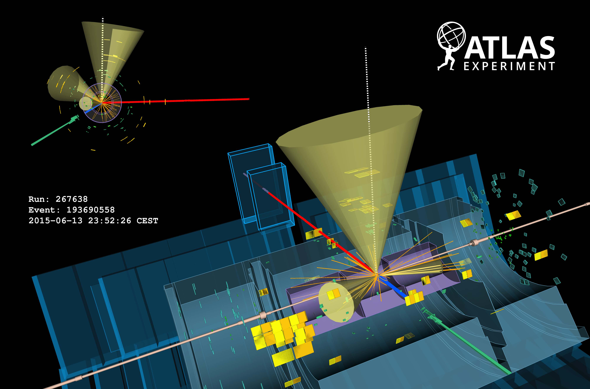

# Analyses

We have prepared seven analyses for you.  Ranging from measuring [Standard Model](http://home.cern/about/physics/standard-model) particles, [Higgs](http://home.cern/topics/higgs-boson) analyses and a search for a beyond the Standard Model particle.

## W Analysis and Z Analysis

The [W](http://home.cern/about/physics/w-boson-sunshine-and-stardust) and [Z](http://home.cern/about/physics/z-boson) bosons are together known as the weak or the intermediate vector bosons. These Standard Model elementary particles mediate the weak interaction.  

It is important to measure well known Standard Model particles, to confirm that we understand properly the detector and software.  We are then ready to search for new physics.

## Top pair Analysis
The top pair analysis is interesting since it is a good test of the Standard Model.

It is important for discrimination between different data simulation generators,  [QCD](https://en.wikipedia.org/wiki/Quantum_chromodynamics) models and parton distribution functions.

In addition, top pair production is an important background in various Higgs boson analyses as well as beyond the Standard Model searches.  It is therefore crucial to understand this process in detail. 

Display of a top pair candidate event recorded by ATLAS with LHC stable beams at a collision energy of 13 TeV. The red line shows the path of a muon with transverse momentum around 140 GeV through the detector. The green line shows the path of an electron with transverse momentum around 170 GeV through the detector. The green and yellow bars indicate energy deposits in the liquid argon and scintillating-tile calorimeters, from these deposits 3 jets are identified with transverse momenta between 30 and 80 GeV. Two of the jets are identified as having originated from b-quarks. Tracks reconstructed from hits in the inner tracking detector are shown as arcs curving in the solenoidal magnetic field. 

## WZ Analysis

This analysis looks for both a W boson and a Z boson.
It is a relatively clean signature due to three leptons in the final state.  It is interesting for physics since it is a probe for triple gauge couplings.

## ZZ Analysis

This analysis looks for two Z bosons where both Z bosons decay to leptons.  

The Higgs boson decaying to two Z bosons which in turn decay to 4 leptons is known as the golden channel.
The importance of this channel was shown by its major role in the discovery of a Higgs-like boson, by the ATLAS and CMS collaborations, with mass near 125 GeV. 

## HWW Analysis

This analysis searches for the standard model Higgs boson produced via the vector-boson fusion mechanism. 

The main background is top pair production in association with one or more jets. So in this analysis we demand that no jets are present, to reduce the background.

## Z' Analysis

The Z' boson is a hypothetical gauge boson that arises from extensions of the electroweak symmetry of the Standard Model. The Z' boson is named in analogy with the Standard Model Z boson.
