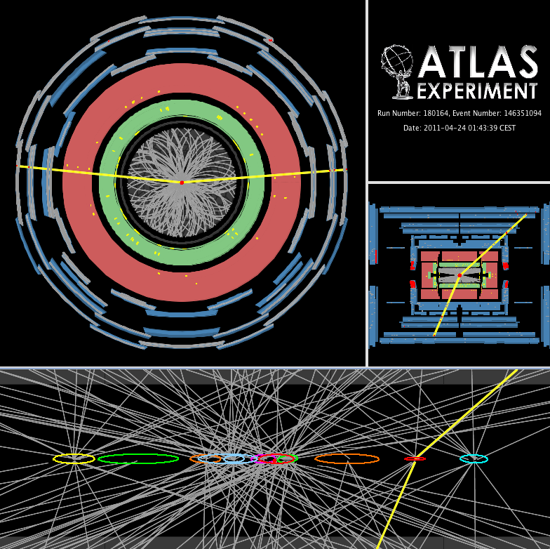

# ATLAS events

Beams of protons are accelerated around the [Large Hadron Collider (LHC)](http://home.cern/topics/large-hadron-collider) and are brought to collide at the centre of the [ATLAS](http://home.cern/about/experiments/atlas) detector. The collisions produce debris in the form of new particles which fly out in all directions. Over a billion particle interactions take place in the ATLAS detector every second.

The protons within the two beams are grouped in bunches which are squeezed down in size to increase the chances of a collision.  In the released data, the bunches crossed every 50 ns.  We get about 30 collisions on average per **bunch-crossing**.  

An **event** is the data resulting from a particular bunch-crossing. 

NOT FINISHED

**Pile-up** is defined as the average number of particle interactions per bunch-crossing and is directly correlated with the instantaneous luminosity.  
[Luminosity](http://home.cern/topics/high-luminosity-lhc) is essentially the rate of collisions.
The higher the luminosity, the more data the experiments can gather to allow them to observe rare processes.
However increased pile-up presents a challenge for physics analyses, to successfully identify collisions of interest resulting in the signal process, from the many background. 

The above event display shows a candidate Z boson decaying into two muons with 11 reconstructed vertices. This event was recorded on April 24th and is typical for the 2011 environment with high pile-up.

The **primary vertex**  from the high transverse momentum inelastic collision of two protons.  

It is essential to reconstruct all the primary vertices in the bunch-crossing and identify the one which is related to the signal process.

The reconstruction of primary vertices is important for
many physics studies, including searches for new particles, identifying jets containing b-quarks or taus and reconstruction of exclusive b-quark decays.