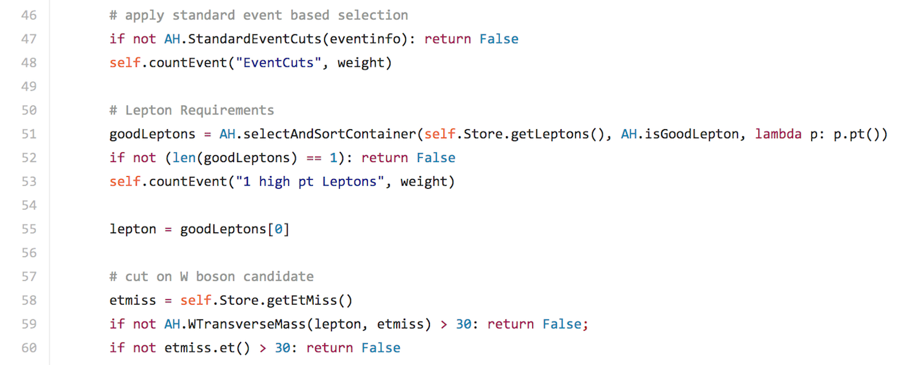
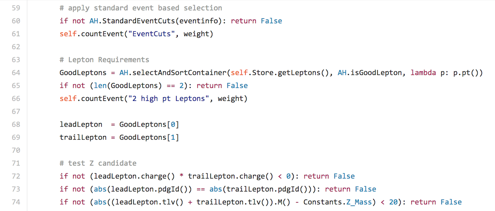
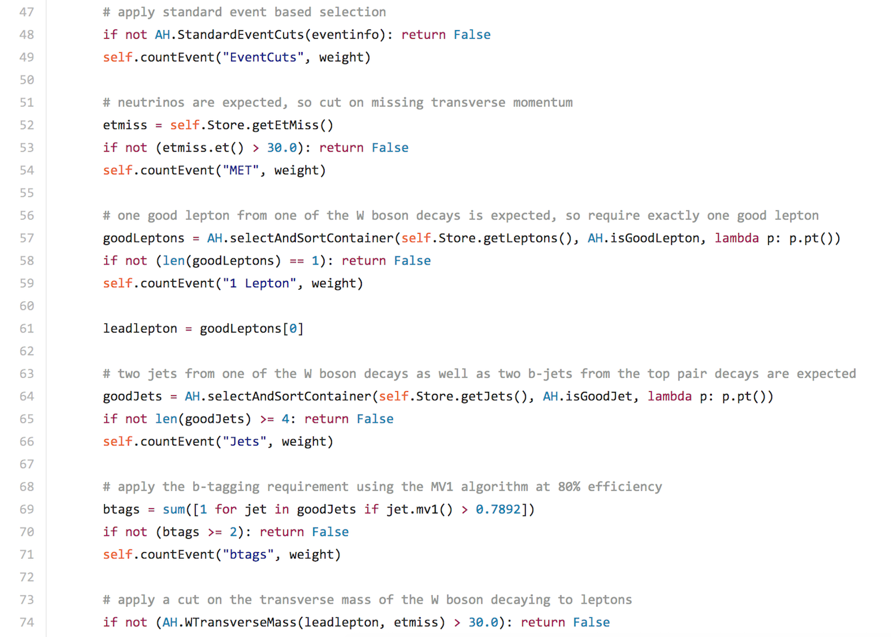
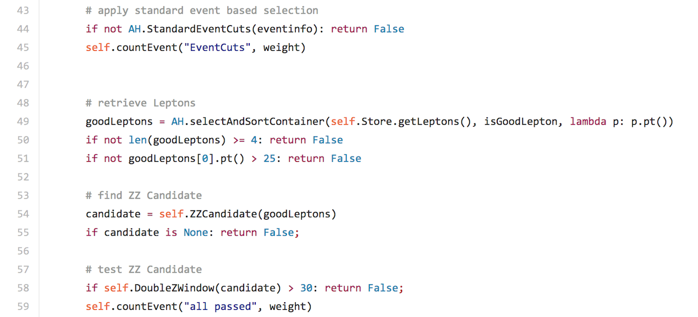
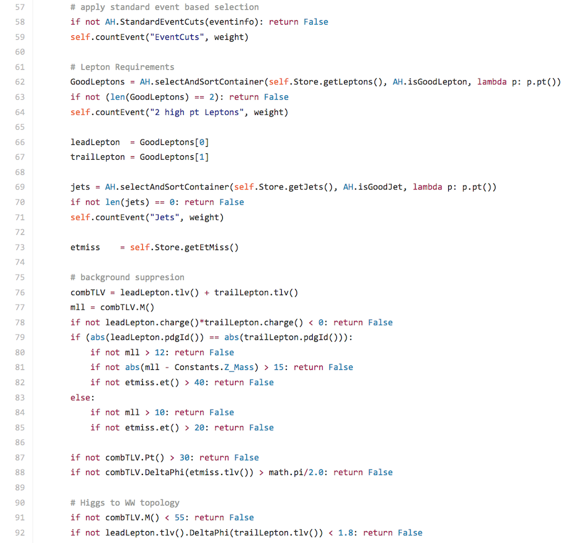
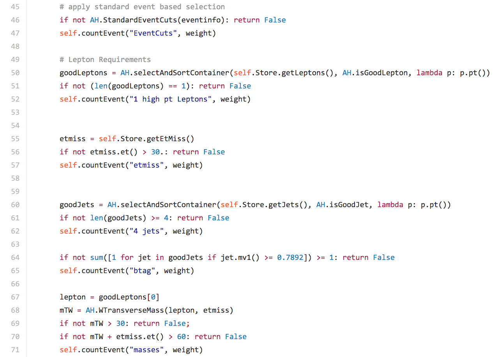

# Event selection

The events in the ntuples have been selected according to the following preselection criteria:

* A single electron or muon trigger has fired;
* The primary vertex has at least 5 tracks;
* There is at least one good lepton with $$p_T$$ > 25 GeV;
* The event passes the Good Run List;
* A veto exists on events containing bad jets.

In addition to these preselection cuts, a standard selection is made (in all the analyses except the $$ZZ$$):

* Leptons: leptons are required to be isolated
such that ptcone30/ $$p_T$$ < 0.15 and etcone20/ $$p_T$$ < 0.15.  
* Jets: a jet vertex fraction cut is applied.

Analysis specific requirements are detailed below.

## $$W$$ Analysis

This analysis searches $$W$$ bosons decaying to leptons. 

The analysis specific event selection criteria are:

* Exactly one good lepton with $$p_T$$ > 25 GeV; 
* Missing ET > 30 GeV;
* Reconstructed transverse mass $$W$$ > 30 GeV.

Here is a snippet from the WAnalysis code:

Look at the code directly [need to work out direct link](https://github.com/atlas-outreach-data-tools/atlas-outreach-data-tools-framework/blob/master/Analysis/WAnalysis.py}
## $$Z$$ Analysis

This analysis seaches for $$Z$$ bosons decaying into a lepton pair. 

The analysis specific event selection criteria are:

* Exactly two good leptons with $$p_T$$ > 25 GeV; 
* Leptons have opposite charge;
* Leptons have same flavour; 
* |reconstructed mass lepton pair - PDG mass $$Z$$< 20 GeV.

Here is a snippet from the ZAnalysis code:

## Top pair Analysis

This analysis searches for a top quark and an antitop quark.

The analysis specific event selection criteria are:

* Exactly one good lepton with $$p_T$$ > 25 GeV; 
* At least four good jets;
* At least two b-tagged jets (MV1@70%);
* Missing ET > 30 GeV;
* Reconstructed transverse mass $$W$$ > 30 GeV.

Here is a snippet from the top pair Analysis code:

## $$WZ$$ Analysis

This analysis looks for both a $$W$$ boson candidate and $$Z$$ boson candidate.

It is a relatively clean signature due to 3 leptons in the final state.  It is interesting for physics since it is a probe for triple gauge couplings.

The analysis specific event selection criteria are:

* Exactly three good leptons with $$p_T$$ > 25 GeV;
* $$WZ$$ candidate is chosen by finding the $$Z$$ boson candidate closest to the nominal $$Z$$ mass;
* |mass lepton pair -  mass $$Z$$ | < 10 GeV;
* Reconstructed transverse mass $$W$$ > 30 GeV.

Here is a snippet from the $$WZ$$ Analysis code:

## $$ZZ$$ Analysis

This analysis looks for two $$Z$$ boson candidates where both $$Z$$ bosons decay to leptons.  

The analysis specific event selection criteria are:

* Exactly four good lepton with $$p_T$$ > 10 GeV;
* Two Z candidates built from leptons pairs of same flavour and opposite charge minimizing the total deviation of both candidates from the Z boson mass;
* |reconstrucetd mass $$Z$$ candidate 1 - PDG mass $$Z$$| + |mass $$Z$$ candidate 2 - mass $$Z$$| < 20 GeV.

Here is a snippet from the $$ZZ$$ Analysis code:

## $$H\rightarrow WW$$ Analysis

This analysis searches for $$W$$ bosons decaying to leptons, with no jets.

$$H\rightarrow W^+W^- \rightarrow ℓ^+ ℓ^-\nu  \bar \nu$$ ($$ℓ$$ = electron, muon)

The analysis specific event selection criteria are:

* Exactly two good leptons with $$p_T$$ > 25 GeV;
* Leptons have opposite charge;
* No jets with $$p_T$$ > 25 GeV;
 
If leptons have same flavor:
* mass lepton pair > 12 GeV;
* |reconstructed mass lepton pair - PDG mass $$Z$$| > 15 GeV;
* Missing ET > 40 GeV;
 
Else:
* mass dilepton pair > 10 GeV;
* Missing ET > 20 GeV;
* $$p_T$$ lepton pair > 30 GeV;
* Angular separation between lepton pair and Missing ET > $$\pi$$/2;
* Reconstructed transverse mass $$W$$ > 30 GeV;
* Mass lepton pair < 55 GeV;
* Angular separation between leptons < 1.8.

Here is a snippet from the $$H\rightarrow WW$$ Analysis code:

## $$Z'$$ Analysis

This analysis searches for $$Z'$$ in the semileptonic top pair channel.

The analysis specific event selection criteria are:

* Exactly one good lepton with $$p_T$$ > 25 GeV;
* At least four good jets;
* At least one b-tagged jet (MV1@70%); 
* Missing ET > 30 GeV;
* Reconstructed transverse mass $$W$$ + Missing ET > 60 GeV.

Here is a snippet from the $$Z'$$code:

