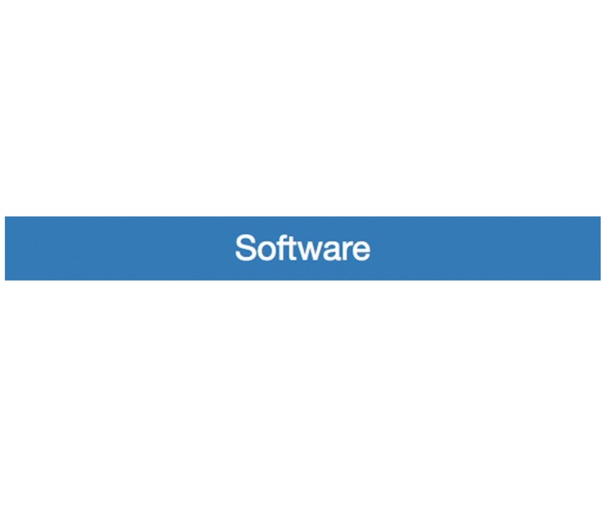

# Setup Your Environment
## ATLAS open data

The ATLAS collaboration has made some data available to everyone.

You need to download some code to get started. It will enable to take a first look at the newly released ATLAS data.  You can then modify the code and make it you own.

### Download the software

Select the 'Download' button at the top right of the page.


You now have access to the ATLAS Data and Tools Repository.

* Scroll down to 'Downloads' and select 'software' and then 'ATLAS outreach data and tools'.



* Select the green 'Clone or download' button. 


* Move the zipped directory to your workarea. Now unzip it. 
 
In the root directory you will see five directories, a README file plus two python scripts.  The python scripts are RunScript.py and PlotResults.py.  The directory names are Analysis, Configurations, Input, Plotting and Output.

### Download the data

* Select the 'Download' button again at the top right of the page.


 
* Scroll down to Downloads and select 'Datasets'


* 'Bulk downloads' will download all the data and simulated data samples.  This may take afew minutes.

*  unzip  complete_set_of_ATLAS_open_data_samples_June_2016.zip and you will see two directories MC and Data.

* Move the directories MC and Data into your Input directory. 


### Nearly there
  
You need to have installed the framework for data processing that is used by all physicists at CERN.

To see if it is already installed, in a terminal window, type into the command line

```root```

If ROOT launches and you get the message 'Welcome to ROOT' you can quit root and move straight onto the next section 'Take a look at the data'.    
    
If not, take a deep breath and 
follow the download instructions provided on the website 
<a href="https://root.cern.ch/downloading-root/" target="_blank"> ROOT

Basically it is enough download the latest ROOT Release and
run a special script distributed with ROOT 

    bin/thisroot.(c)sh

**Now you are ready to take a look at the data
**
