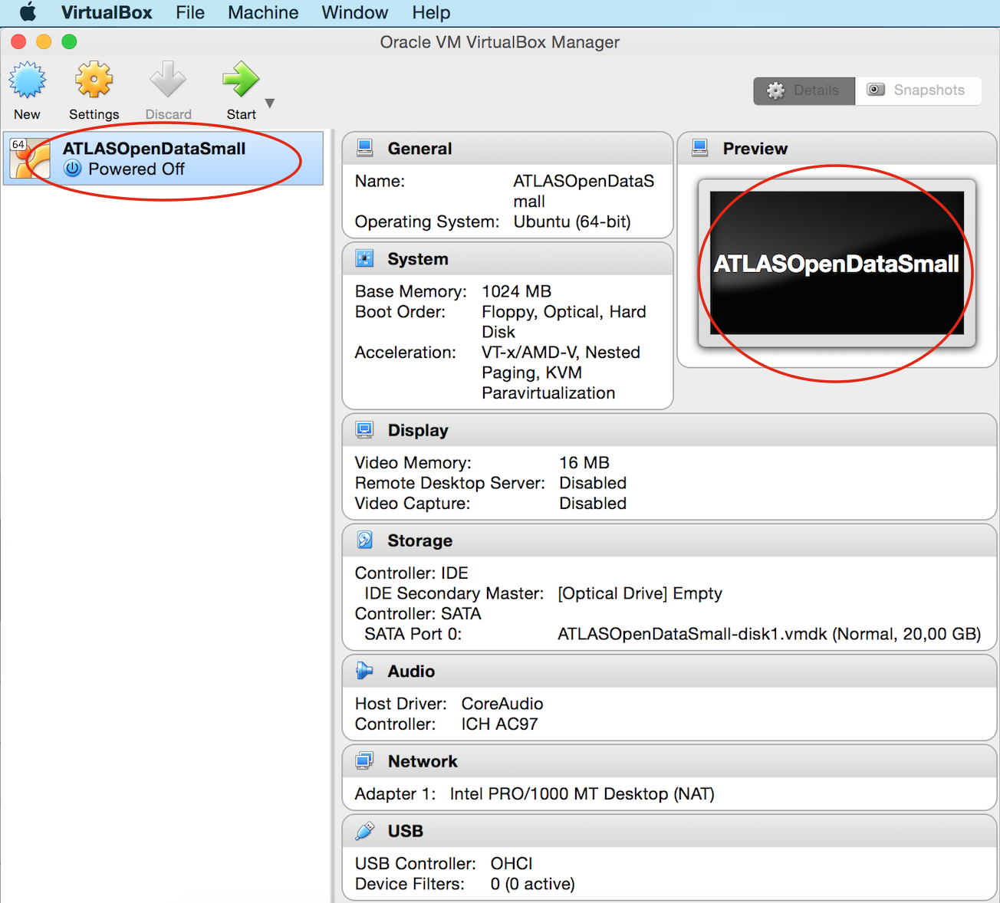

# Setup Your Environment

You will learn how to download and prepare a virtual machine to run on your computer.  This will then enable you to take a look at ATLAS data.

There are two steps to setup your environment
1. Download and install VirtualBox
2. Download and install a virtual machine.

## What is a virtual machine ?

A virtual machine will transform your computer into an analysis machine!

Your physical computer will be the "host", while the virtual machine will be a "guest". Most of the guest code runs unmodified, directly on the host computer, and the guest operating system "thinks" it's running on a real machine.

A virtual machine allows an unmodified operating system with all of its installed software to run in a special environment, on top of your existing operating system. 

There are five virtual machines available.
We suggest you start with the **small** version.  It contains everything you need to start looking at the data.

## Download the Small Virtual Machine (VM Version S)

A small virtual machine using Lubuntu in conjunction with ROOT-5.34.14 and 10% of the data has been prepared. This is 1.7Gb in size so can be downloaded fairly quickly. 

**Make sure you download the SMALL virtual machine if you are following these instructions.**

# Step 1: Get the VirtualBox

First, you need to download and install VirtualBox.
Use the VirtualBox website to download the software

<a href="https://www.virtualbox.org/" target="_blank"> Go to the VirtualBox website</a>

Select **Download VirtualBox**
 

Take care to select the appropriate **VirtualBox platform package**.

 
Proceed with the installation of VirtualBox:

## Step 2: Set up your Virtual Machine

Start VirtualBox.

Look for the VirtualBox icon in your Applications (folder). Double click to get the main interface of VirtualBox:

Select File/ Import Appliance

An empty text box will appear

Use the yellow folder icon on the right hand-side of the empty text box to select your virtual machine (the .ova file you downloaded at the start of this chapter).  Then press "Continue".

**Make sure you have downloaded the small virtual machine.  It will be called "ATLASOpenDataSmall.ova"**

The default settings are displayed.  We recommend you use these.  Press "Import"

Import will take afew minutes

Select your virtual machine 'ATLASOpenDataSmall' (which is powered off)

**Make sure you have downloaded the small virtual machine.  It will be called "ATLASOpenDataSmall"**

Your VM will then be displayed

**Check that the name of your virtual machine displayed on the right is "ATLASOpenDataSmall"
**

Press the green 'Start' arrow.

WAIT afew minutes whilst the virtual machine sets up.  

When it has completed you will see 
the terminal for using the code, with the Readme file opened using the atom editor.

In the menu on the left handside, you see the contents of the root directory.

In the root directory there are five directories (Analysis, Configurations, Input, Plotting and Output), the README file plus two python scripts. The python scripts are RunScript.py and PlotResults.py. 

At the bottom of your window, you will notice a tab labelled "atlas@atlas-vm".

Select this tab, circled in red in the screen-shot.  A terminal window will then be available. 

Type "ls" and you will see the folders and files in your main directory.

You are now ready to start looking at the ATLAS data.

**If your session goes to sleep and requires the atlas password, it is 'atlas'.** 

