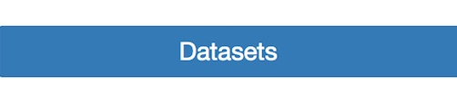

# Setup Your Environment
## ATLAS open data

The ATLAS collaboration has made some software and data available to everyone.

You have a choice:

* **Download the software and datasets to your machine**: continue with the instructions below
* **Use a virtual machine**: follow the instructions in the Virtual Machine Book

If you are not sure, we recommend Virtual Machine Version M.

### Download the software

You need to download some code to get started. It will enable to take a first look at the newly released ATLAS data.  You can then modify the code and make it you own.

Select the 'Download' button at the top right of the page, then the 'software' button.


Or just directly select software. 


You now have access to the ATLAS Outreach  data and tools repository. You have a choice to take a look and download the source code from GitHub  


or just download the files as a zip file.  


If you are not sure which to choose, just download the files as a zip file. Select the latest version.
 
Move the downloaded directory (atlas-outreach-data-tools-framework) to your workarea. You may need to unzip it. 
 
In the root directory you will see five directories (Analysis, Configurations, Input, Plotting and Output), a README file plus two python scripts.  The python scripts are RunScript.py and PlotResults.py. 

### Download the data

Select the 'Download' button again at the top right of the page, then select 'Datasets'.




Or just directly select datasets. 


You now have a choice to download individual data files (Monte Carlo simulated samples and real data samples) one at a time, or all together.


'Bulk downloads' will download all the data and simulated data samples.  This may take afew minutes.  Please be patient.

When the download has completed unzip  complete_set_of_ATLAS_open_data_samples_July_2016.zip and you will see two directories MC and Data.

Move the directories MC and Data into your Input directory (within your downloaded atlas-outreach-data-tools-framework). 

```mv complete_set_of_ATLAS_open_data_samples_July_2016/ atlas-outreach-data-tools-framework-1.1/Input/.```

### Nearly there
  
You need to have installed the ROOT framework for data processing that is used by all physicists at CERN.

To see if it is already installed, in a terminal window, type into the command line

```root```

If ROOT launches and you get the message 'Welcome to ROOT' you can quit root 
(by typing -q)
and move straight onto the next section 'Take a look at the data'.    
    
If not, you have one more step.  Take a deep breath and 
follow the download instructions provided on the website 
<a href="https://root.cern.ch/downloading-root/" target="_blank"> ROOT

Basically it is enough to download the latest ROOT release and
run a special script distributed with ROOT 

    config/thisroot.(c)sh

**Now you are ready to take a look at the data
**
