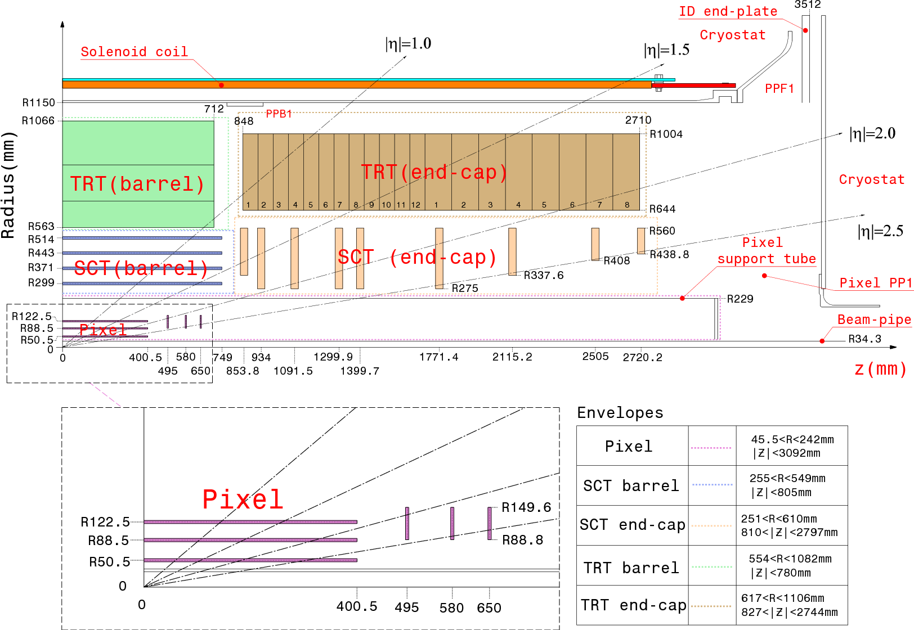
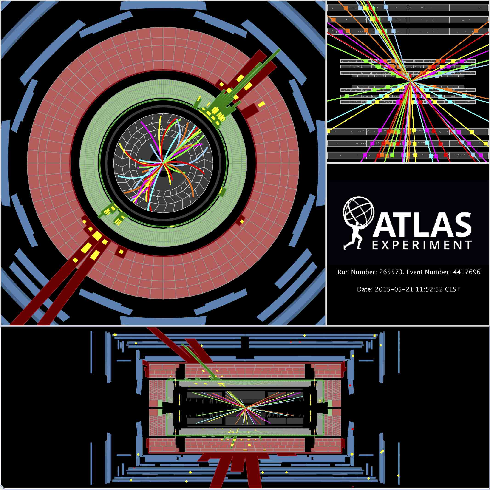

# Glossary

This is not intended to be an exhaustive glossary.  You will find answers to many of your questions by using a search engine.  However, here are afew ATLAS physics terms explained to start you off.

## ATLAS coordinate system

The coordinate system of ATLAS is a right-handed coordinate system with the x-axis pointing towards the centre of the LHC tunnel, and the z-axis along the tunnel. The y-axis is slightly tilted with respect to vertical due to the general tilt of the tunnel. 

# Detector layout

The ATLAS detector has a layout that is typical for a collider detector and consists of two types of detector components: 
* tracking detectors measure the position of a charged particle.
* calorimeters measure the energy of a particle. 

The complete ATLAS detector is split into a barrel part, where detector layers are positioned on cylindrical surfaces around the beam axis, and two end-cap parts, where detector layers are positioned in planes of constant z perpendicular to the beam pipe.

## Pseudorapidity 

The pseudorapidity ($$\eta$$) describes the angle of a particle relative to the beam axis.  

This diagram shows the cross-section of the inner detector layout through the beam axis.

The ATLAS detector design is symmetrical in pseudorapidity. 
The detector region |eta|>3 is particularly challenging since particle densities and energies are at their highest.

In hadron collider physics, particle production is normally constant as a function of pseudorapidity.  

## Azimuth angle

Phi ($$\phi$$) is measured from the x-axis, around the beam.
The ATLAS detector design is symmetrical in $$\phi$$.

Display of a proton-proton collision event recorded by ATLAS on 21 May 2015 at a collision energy of 13 TeV. Here you see the event displayed in $$\phi$$ (top left).

Tracks reconstructed from hits in the inner tracking detector are shown as arcs curving in the solenoidal magnetic field. The green, red and yellow bars indicate energy deposits in the liquid argon and scintillating-tile calorimeters, clustered in a structure typical of a di-jet event. 

## Angular separation

The angular separation between physics objects e.g.lepton pair can be important in understanding or identifying different physics processes.
It is calculated as a function of $$\eta$$ and $$\phi$$.

Isolation can be required, meaning that there must be a minimum angular separation from any other significant object.

## Good Run List
Good run lists are the way to select good data samples for physics analysis. 
There are a number of ways the data may not be good e.g the LHC is not in stable-beam mode, the magnets are off, some of the sub-detectors are switched off.

## Jets

Jets are the dominant final state objects of high-energy proton-proton interactions at the LHC. They are key ingredients for many physics measurements and for searches for new phenomena. Jets are observed as groups of topologically-related energy deposits in the ATLAS calorimeters, most of which are associated with tracks of charged particles as measured in the inner detector. They are reconstructed and calibrated using a combination of methods based on simulation and data-driven techniques.

### Good, bad and ugly jets
Jet cleaning criteria have been developed in order to identify fake jets which arise due to noise or to out-of-time energy depositions. Jets failing these criteria are flagged as either “bad”, likely to be fake, or “ugly”, likely to be mismeasured due to falling into less well instrumented regions.

In these analyses only events with good jets are considered.

### Jet Vertex Fraction (JVF)
The Jet Vertex Fraction can be used to select jets with a high fraction of track energy originating from the selected primary vertex.  It can be used to suppress pile-up jets. 

