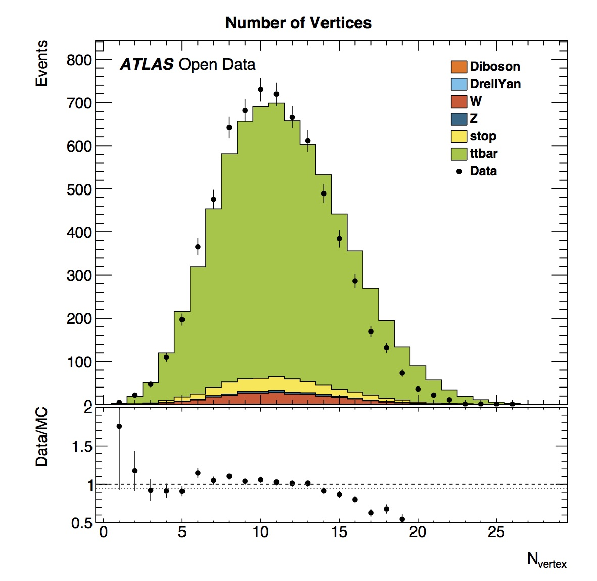
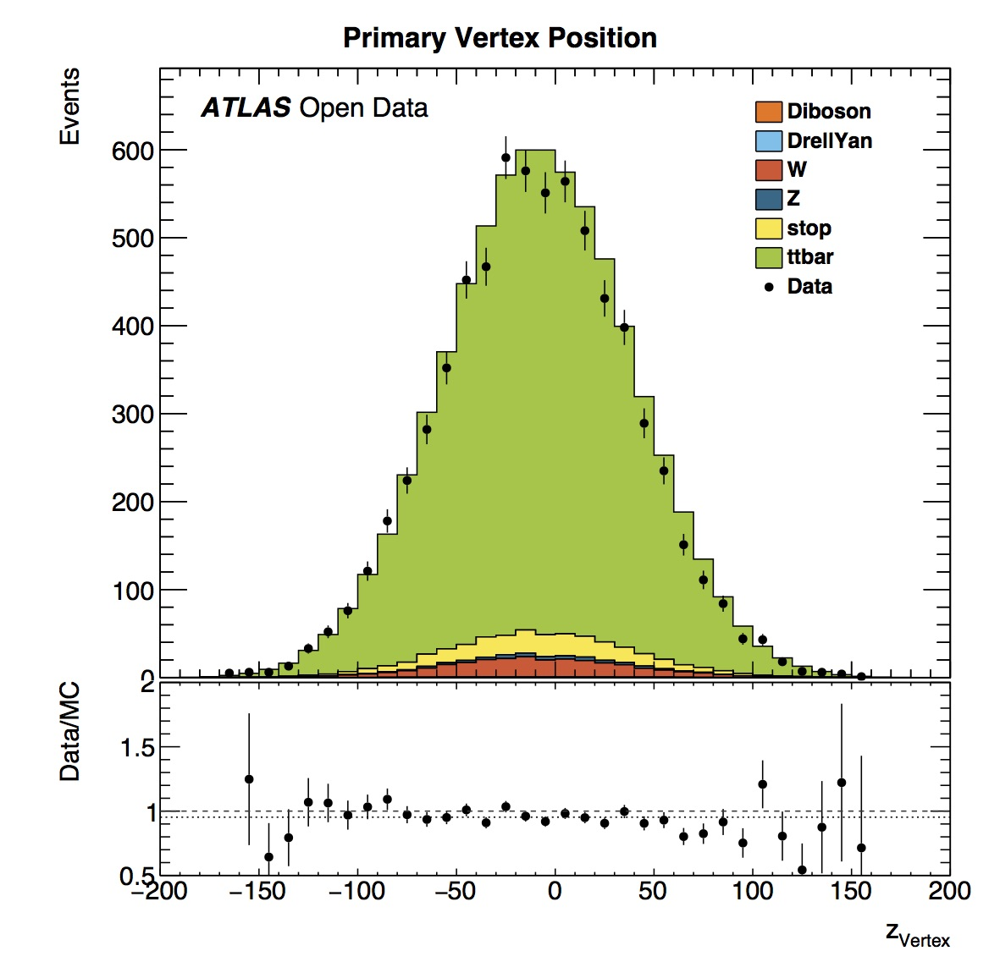
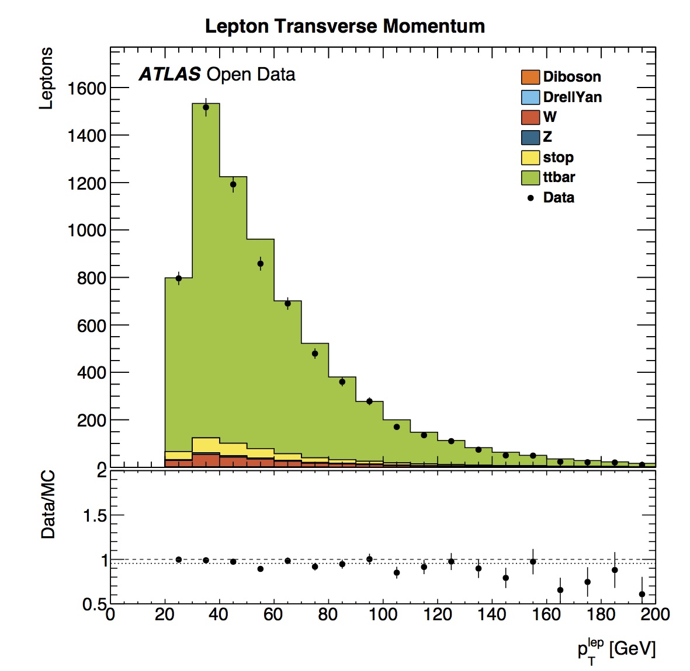

# Histograms

After running the analysis you will have lots of histograms in your output directory.  Let's take a look.

Here we can see the number of vertices in this top pair analysis (TTbarAnalysis)  ranges from around 0 to 25.
The data and simulated data have a similar shape.  However there is a slight offset due to ... 

The primary vertex position in the coordinate z (where the z axis follows the beam direction and positive z points towards Geneva) is centered around zero.  This is expected since the origin of the coordinate system is the nominal interaction point.

We also see that the number of jets  varies from 4 to 9.  Simulated data shows a similar distribution of numbers of jets.
The jet [pseudorapidity](https://en.wikipedia.org/wiki/Pseudorapidity) distribution is symmetrical, which is expected since the ATLAS detector itself is symmetrical in pseudrapidity.
The jet transverse momentum (pT) distribution has a maximum between 30 and 40 GeV. The simulated data slightly over-estimates the data jet pT distribution.

Looking at lepton Particle Data Group ([PDG](http://pdg.lbl.gov)) we see peaks at 11 and 13.  These correspond to electrons and muons according to the official [numbering scheme](http://pdg.lbl.gov/2015/reviews/rpp2015-rev-monte-carlo-numbering.pdf).  

