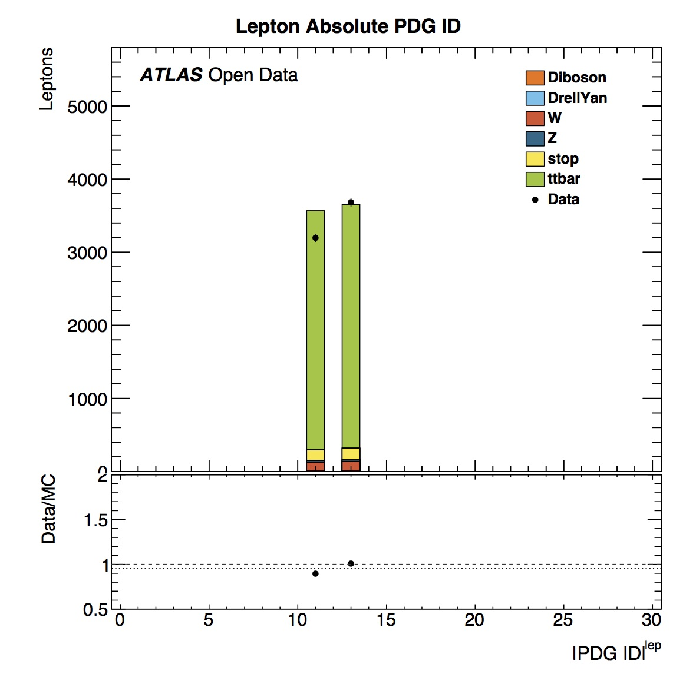
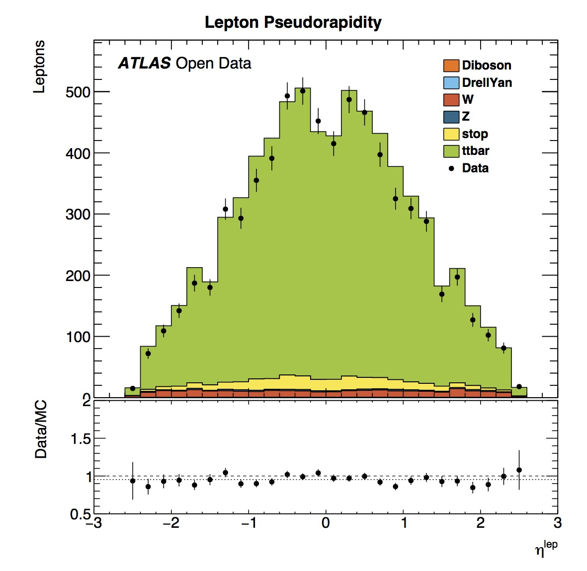
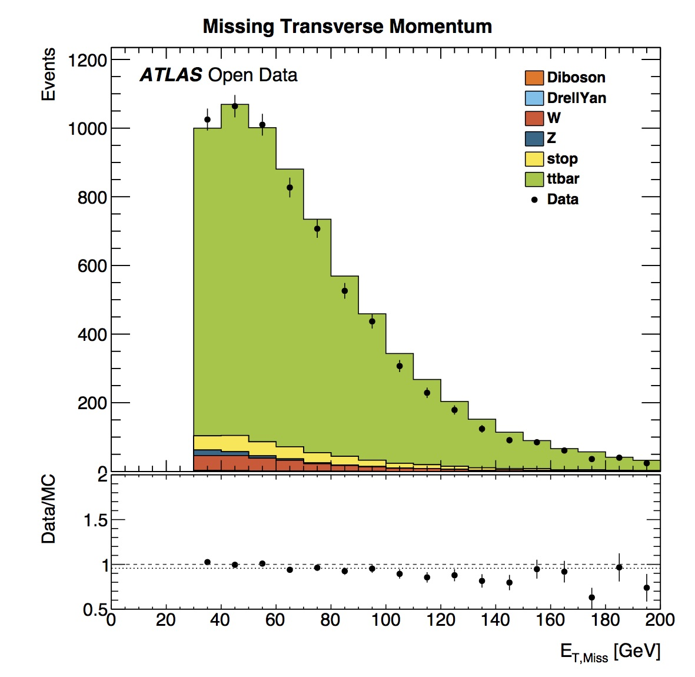

# Histograms

After running the analysis you will have lots of histograms in your output directory.  Let's take a look.

Here we can see the number of vertices in this top pair analysis (TTbarAnalysis)  ranges from around 0 to 25.  The data and simulated data have a similar shape.  However there is a slight offset visible.
This offset is caused by the way the datasets for the measured and simulated data are prepared. For measured data we use a subset of the whole 2012 data taking (more specifically some runs from sub period 2012D). In the simulated data we try to mimic the collision characteristics found in the measured data. The simulated data is geared towards emulating these characteristics for the whole data taking period. These characteristics change between sub periods so what we obtain in a certain sub period does not have to look exactly the same way as for the whole data taking which introduces the observed differences.

The primary vertex position in the coordinate z (where the z axis follows the beam direction and positive z points towards Geneva) is centered around zero.  This is expected since the origin of the coordinate system is the nominal interaction point.

We see that the number of jets varies and one can see that events with more and more jets are increasingly rare.
Simulated data shows a similar distribution of numbers of jets.
The jet [pseudorapidity](https://en.wikipedia.org/wiki/Pseudorapidity) distribution is symmetrical, which is expected since the ATLAS detector itself is symmetrical in pseudorapidity.
The jet transverse momentum (pT) distribution has a maximum between 30 and 40 GeV. The simulated data slightly over-estimates the data jet pT distribution.

Looking at lepton Particle Data Group ([PDG](http://pdg.lbl.gov)) ID we see peaks at 11 and 13.  These correspond to electrons and muons according to the official [numbering scheme](http://pdg.lbl.gov/2015/reviews/rpp2015-rev-monte-carlo-numbering.pdf).  The histogram is showing absolute values of ID, hence we do not see separately positrons (PDGID=-11) or anti-muons (PDGID=-13).  
This TTbarAnalysis requires 'exactly one good lepton with pT > 25 GeV' (see chapter 'Event Selection').  Indeed this agrees with the distributions seen in Number of Leptons and Lepton Transverse Momentum.
The Lepton pseudorapidity distribution is symmetrical, with data and simulated data in agreement.

The transverse mass of the $$W$$ candidate shows a peak in the distribution in the 75-80 GeV bin.  The average W mass based on [published results](http://pdg.lbl.gov/2012/listings/rpp2012-list-w-boson.pdf) is 80.385 +/- 0.015 GeV.
The data and simulated data distributions are in reasonable agreement.

Missing transverse momentum is defined as the event momentum
imbalance in the plane transverse to the beam axis, where momentum conservation is expected.  Such an imbalance may signal the presence of undetectable particles, such as neutrinos or new stable, weakly-interacting particles.

