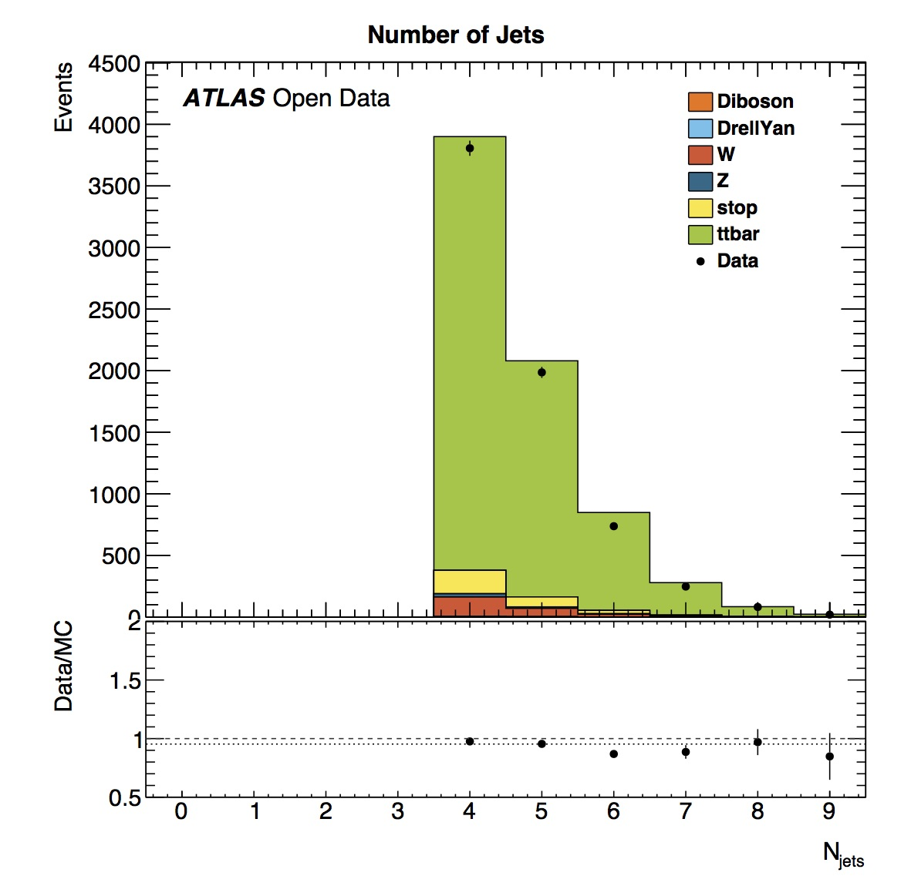
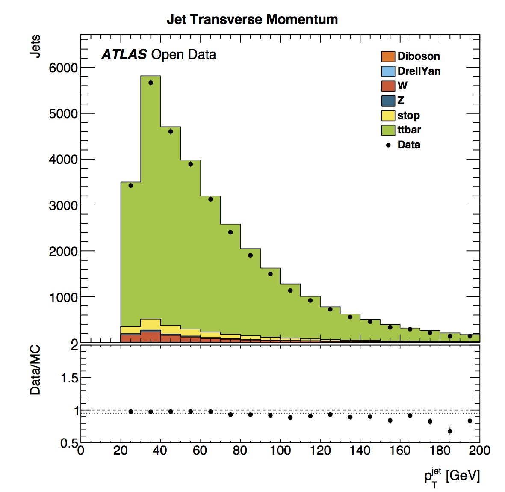

# Histograms

After running the analysis you will have lots of histograms in your output directory.  Let's take a look.

Here we can see the number of vertices ranges from around 5 to 20.
The data and simulated data have a similar shape.  However
the data points have large error bars, indicating that we do not have a large amount of data, which makes it difficult to make strict comparisons. 

We also see that the number of jets in this vector boson scattering analysis (VBSAnalysis) varies from 2 to 6.  Simulated data shows a similar distribution of numbers of jets, although the number of events in data is more.

What plots do we want to show here?  
What do we want to say?  