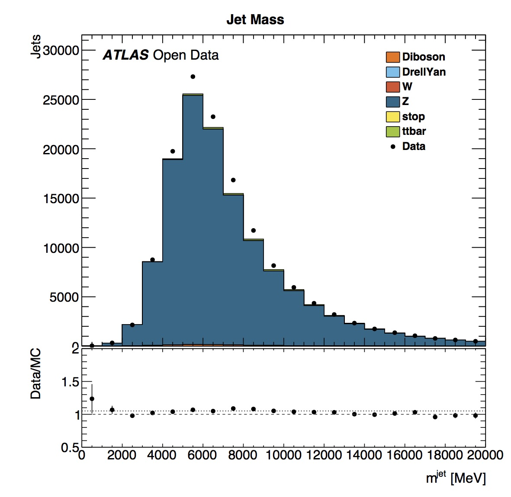
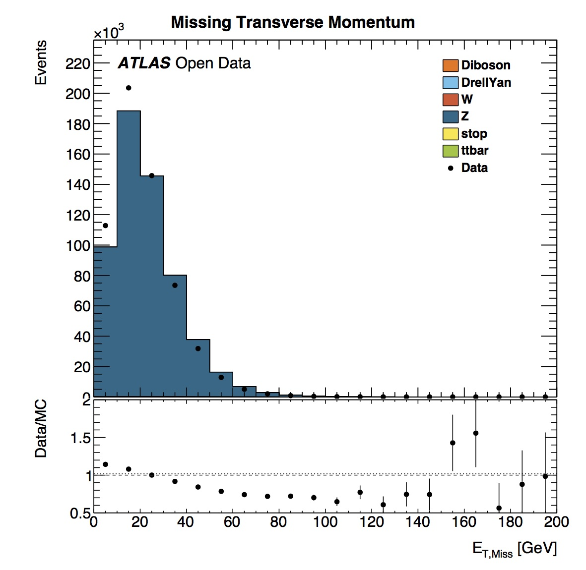
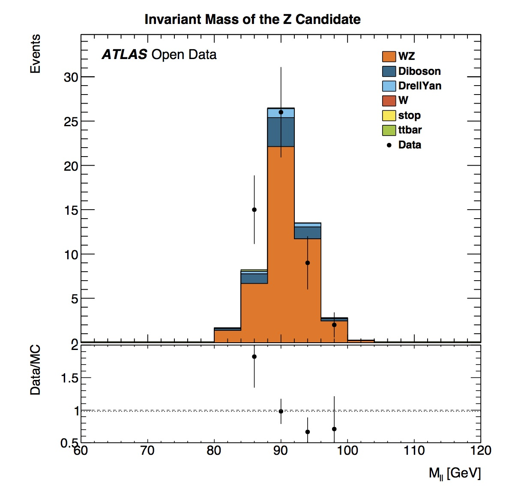
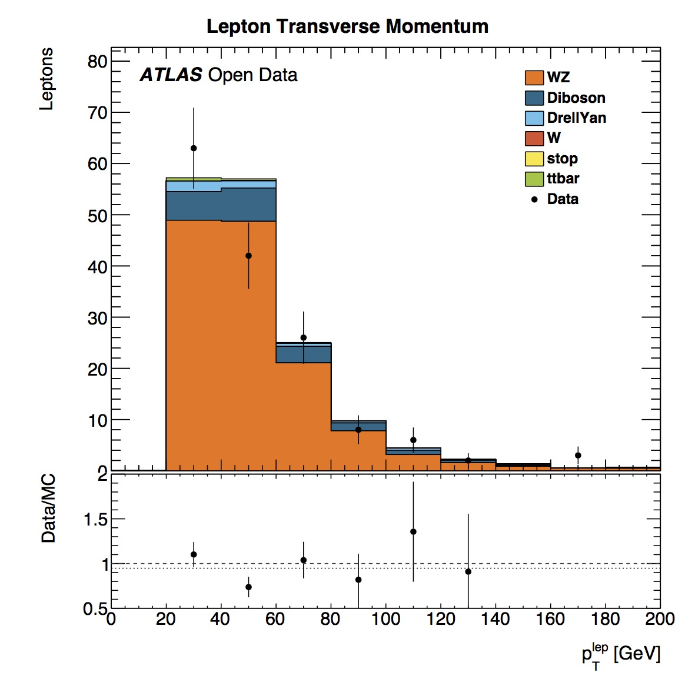

# More histograms

## Z Analysis

The transverse mass of the Z candidate shows a peak in the distribution in the 90-95 GeV bin.  The average Z mass based on [published results](http://pdg.lbl.gov/2012/listings/rpp2012-list-z-boson.pdf) is 91.1876 ± 0.0021 GeV.  The data and simulated data distributions are in good agreement.

## WZ Analysis

Here we can see the reconstructed mass of the W and Z bosons.
The transverse mass of the Z candidate shows a peak in the distribution in the 88-92 GeV bin.  This is in good agreement with the [published value](http://pdg.lbl.gov/2012/listings/rpp2012-list-z-boson.pdf) of 91.1876 ± 0.0021 GeV.
The transverse mass of the W candidate shows a peak in the distribution in the 60-80 GeV bin.
This is in reasonable agreement with the [published value](http://pdg.lbl.gov/2012/listings/rpp2012-list-w-boson.pdf) of 80.385 ± 0.015 GeV

