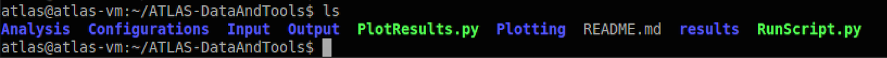
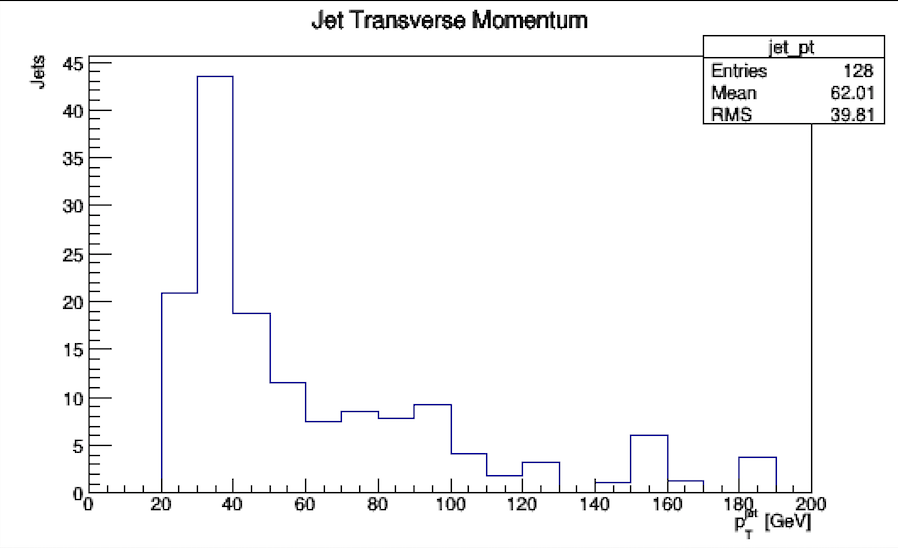
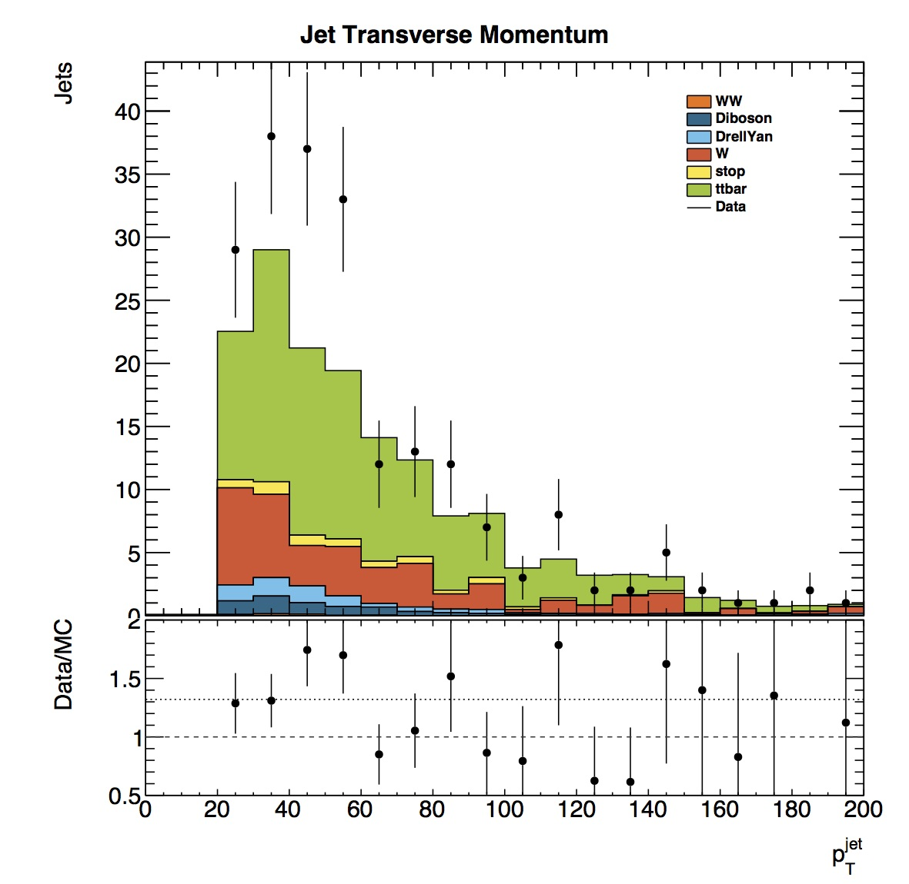
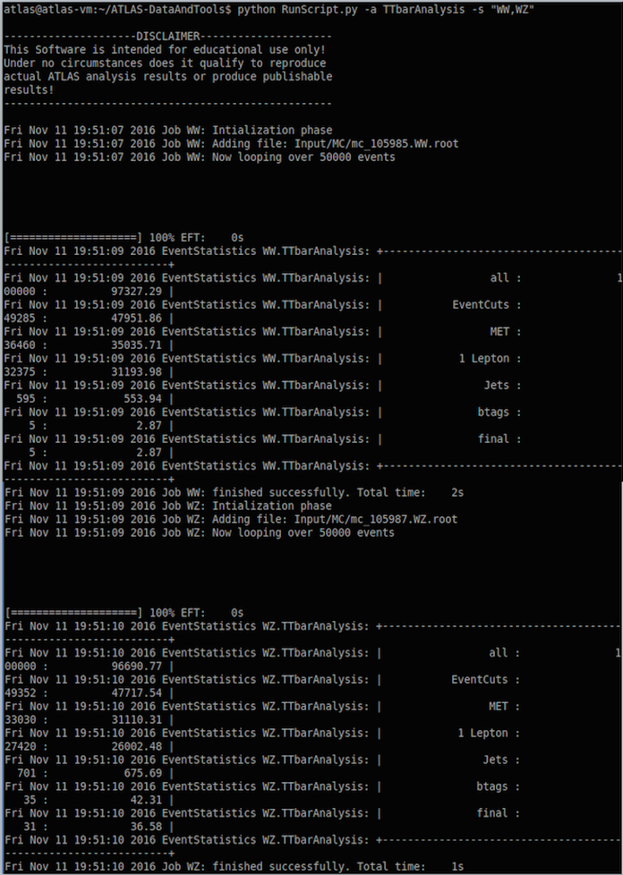
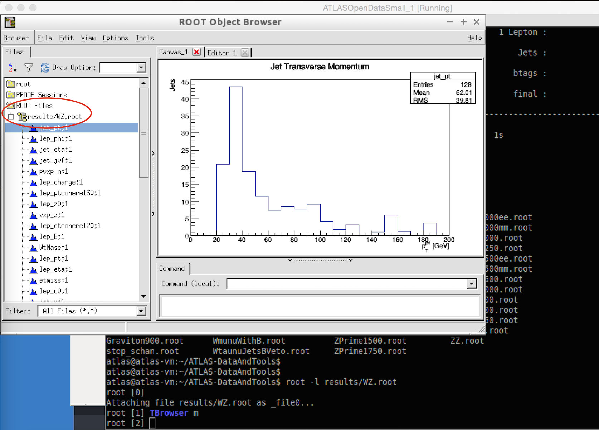
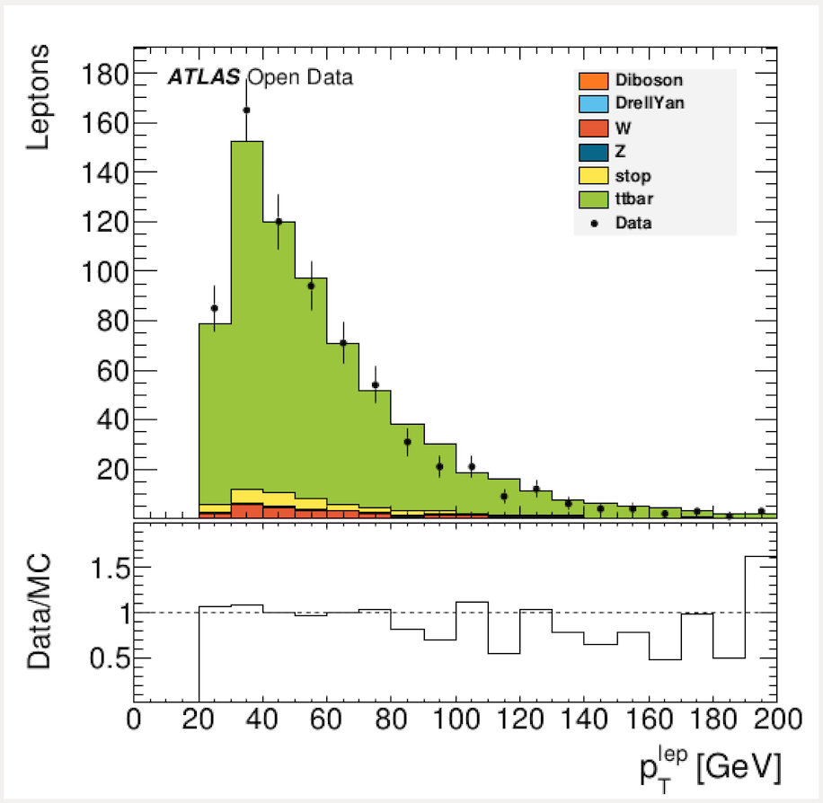

# Take a look at the data

In your terminal window, you are in the main directory ATLAS-DataAndTools.  Here you can see RunScript.py and PlotResults.py

There are two steps to looking at the data.

1. Run RunScript.py to produce histograms of individual variables eg jet_pt.  The histograms are written to your results folder. 
2. Run PlotResults.py to scale the histograms, colour them in and stack them.  Combined plots are then produced, for all the simulated and real data.  These plots are written to your Output folder.

## Run an analysis

Type the following into the command line

    python RunScript.py -a TTbarAnalysis -s "WW,WZ"

This runs the code called 'TTbarAnalysis' with just the WW and WZ data samples.

The analysis should run, telling you about Event Statistics and complete by saying "Job WZ: finished successfully".

The resulting histograms are put into the results folder.

If you want to look at the histograms, launch root and specify the file you want to display
    
    root -l results/WZ.root
    
    TBrowser m
    
The click on ROOT Files results/WZ.root to see all your histograms.
Click on a variable name to display the histogram.

To quit root and return to the command line prompt

    .q
    

**The RunScript has several options which are displayed by typing**

    python RunScript.py --help

The options include:

    -a,            --analysis              overrides the analysis that is stated in the configuration file
    -s,            --samples               comma separated string that contains the keys for a subset of processes to run over
    -p,            --parallel              enables running in parallel (default is single core use)
    -c CONFIGFILE, --configfile CONFIGFILE specifies the config file to be read (default is Configurations/Configuration.py)
    -n NWORKERS,   --nWorkers NWORKERS     specifies the number of workers if multi core usage is desired (default is 4)

To run over the full set of available data samples (if you have downloaded them) takes between 1 to 1.5 hours in single core mode:

    python RunScript.py -a TTbarAnalysis

Execution times are reduced to ~ 15 minutes in multi core mode:

    python RunScript.py -a TTbarAnalysis -n 4

## Plot the results

Results for the WW and WZ analyses may now be plotted using the relevant plotting configuration file. 

    python PlotResults.py Configurations/PlotConf_TTbarAnalysis.py

The resulting plots are put into the Output folder.

    ls Output/
    
This will list the pdf files containing your plots.    

To display a plot use evince, for example

    evince Output/lep_pt
    
    

If, as we suggested, you are using the small Virtual Machine, you only have 10% of the data.  You do not have access to all the data for all the analyses.  For the moment you can take a look at WW and WZ.  For the other analyses you need to download the rest of the data and move it into your Input directory.

